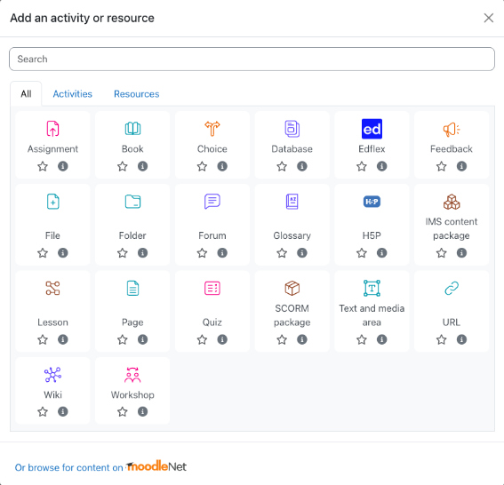
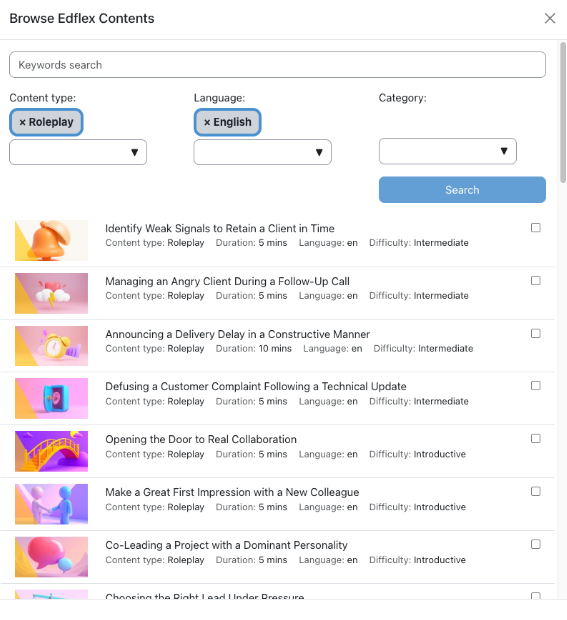
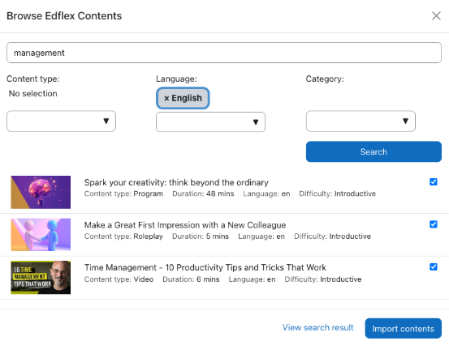
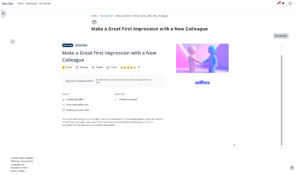

# Edflex Connector #

Supercharge your Moodle courses by embedding a world-class, expertly curated content library directly into your learning environment. The Edflex Connector for Moodle allows you to seamlessly integrate thousands of engaging resources from top-tier global publishers, creating a richer, more dynamic learning experience for your users.

## Why Edflex for Moodle? ##

Edflex is a complete skills development solution. We transform passive learning into active skill-building by providing a unique journey that starts with Skill Assessment to identify needs and ends with practical application through AI-powered Roleplays. Our unique OPAD methodology ensures that every resource is vetted for quality and pedagogical impact, so you can stop searching for content and start building skills.

With this plugin, you can now bring the full power of Edflex’s quality-first approach to your Moodle users, all within a single, unified ecosystem.

## Key features ##

- Seamless content integration: Effortlessly browse the entire Edflex catalog from within Moodle and add any resource (videos, podcasts, articles, interactive courses, and more) as an activity in your Moodle courses.
- Automated activity synchronization: Keep track of learner progress with automatic updates. When a user completes an Edflex resource, the activity is marked as complete in Moodle, ensuring accurate reporting and a seamless user experience.
- Unified learner experience: Provide a single, familiar interface for your learners. Users can access Edflex content directly from Moodle without needing to log in again, reducing friction and boosting engagement.
- Access to a world-class curated library: Empower your course creators with access to a constantly evolving catalog of the best resources, covering 300+ skills in 35+ languages and 25 formats, all selected by our team of learning experts.

## Useful Links ##

More information about Edflex: https://www.edflex.com/en

## Screenshots ##

### Add Edflex as a Course Activity ###

### Browse Edflex contents ###

### Look for Edflex Contents before importing them ###

### Edflex Content Display in Moodle ###

--- 

## Installing via uploaded ZIP file ##

1. Log in to your Moodle site as an admin and go to _Site administration >
   Plugins > Install plugins_.
2. Upload the ZIP file with the plugin code. You should only be prompted to add
   extra details if your plugin type is not automatically detected.
3. Check the plugin validation report and finish the installation.

## Installing manually ##

The plugin can be also installed by putting the contents of this directory to

    {your/moodle/dirroot}/mod/edflex

Afterwards, log in to your Moodle site as an admin and go to _Site administration >
Notifications_ to complete the installation.

Alternatively, you can run

    $ php admin/cli/upgrade.php

to complete the installation from the command line.

## License ##

2025 Edflex <support@edflex.com>

This program is free software: you can redistribute it and/or modify it under
the terms of the GNU General Public License as published by the Free Software
Foundation, either version 3 of the License, or (at your option) any later
version.

This program is distributed in the hope that it will be useful, but WITHOUT ANY
WARRANTY; without even the implied warranty of MERCHANTABILITY or FITNESS FOR A
PARTICULAR PURPOSE.  See the GNU General Public License for more details.

You should have received a copy of the GNU General Public License along with
this program.  If not, see <https://www.gnu.org/licenses/>.
